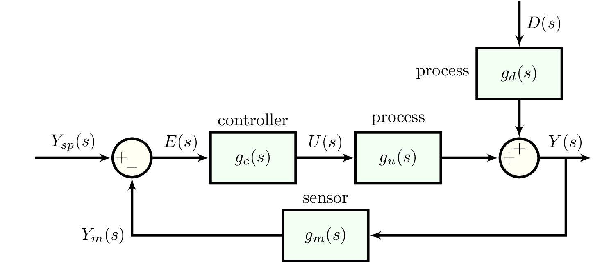
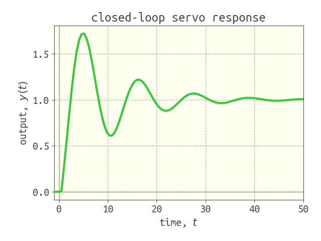

# Control systems

we build upon `simulate` to simulate feedback and feedforward control systems.

## P, PI, PID controller transfer functions

we express PID controller transfer functions in the form:

$$g_c(s)=K_c \left[1+\frac{1}{\tau_I}+\tau_D s \frac{1}{\tau_D \alpha s + 1}\right]$$

where $\alpha$ characterizes the derivative filter. this controller function function governs the controller output in response to the input error signal.

To construct P, PI, or PID controllers:

```julia
Kc = 2.0 # controller gain
pc = PController(Kc) # P-controller with given Kc

τI = 1.0 # integral time constant
pic = PIController(Kc, τI) # PI-controller with given Kc, τI

τD = 0.1 # derivative time constant
pidc = PIDController(Kc, τI,  τD, α=0.0) # PID-controller with given Kc, τI, τD. keyword argument is derivative filter α
```

to construct controller transfer functions $g_c(s)$ from the P, PI, or PID controller parameters:

```julia
pic = PIController(2.0, 1.0)
gc = TransferFunction(pic) # (2s+2) / s
```

## servo response of a simple control system

with skills in block diagram algebra, we can use [`simulate`](@ref) to simulate a control system with a great degree of flexibility. as an example, we simulate the response of a simple feedback control system to a set point change.


let's specify $g_c(s)$ as a PI controller and $g_u(s)$ as a first-order system. the former describes the controller output responds to the error signal. the latter describes how the process responds to inputs-- here, the process input is provided by the controller.

```julia
pic = PIController(1.0, 1.0) 
gc = TransferFunction(pic) # controller transfer function
gu = 3 / (4 * s + 1) # process transfer function
```

via block diagram algebra, we can solve for the transfer function governing the response to set point changes.

```julia
g_ol = gc * gu # open-loop transfer function

g_servo = g_ol / (1 + g_ol) # transfer function for servo response
```

the response of the process to a unit step set point change is thus:
```julia
Y_sp = 1 / s # unit step set point change
Y = g_servo * Y_sp # resulting output in response to our set point change
```

finally, we can find the response by inverting `Y` into the time domain:
```julia
final_time = 12.0
data_y = simulate(Y, final_time)
```

to also see the controller output, we build the error signal `E` and use $g_c(s)=U(s)/E(s)$ to get `U`.

```julia
E = Y_sp - Y # error signal
U = gc * E # resulting controller output
data_u = simulate(U, final_time) # controller output in the time domain
```

an easy way of getting the set point $y_{sp}(t)$ is:
```julia
data_y_sp = simulate(Y_sp, final_time)
```

finally, we can plot `y`, `ysp`, and `u` against `t` to visualize the response of our feedback PI control system to a set point change.


also plotted separately is the contribution to the controller output by the P- and I- components of the PI controller, obtained via:
```julia
U_Paction = Kc * E # P-action
U_Iaction = Kc / (τI * s) * E # I-action

data_u_Paction = simulate(U_Paction, final_time)
data_u_Iaction = simulate(U_Iaction, final_time)
```

## feedback loops with time delays

when time delays are involved, we must use the special implementation of a transfer function, `ClosedLoopTransferFunction`. we provide an example below.



suppose the transfer functions in the block diagram are as defined below.

```julia
# PI controller transfer function
pic = PIController(1.0, 2.0)
gc = TransferFunction(pic)

# process, sensor dynamics
gu = 2 / (4 * s + 1) * exp(-0.5 * s)
gm = 1 / (s + 1) * exp(-0.75 * s)
gd = 6 / (6 * s + 1)
```

we define the closed-loop transfer functions for the response to set point changes $y_{sp}(t)$ and disturbances $d(t)$ as below:

```julia
# open-loop transfer function
g_ol = gc * gu * gm

# closed-loop transfer function for regulator response
gr = ClosedLoopTransferFunction(gd, g_ol)

# closed-loop transfer function for servo response
gs = ClosedLoopTransferFunction(gc * gu, g_ol)
```

where `gr` and `gs` represent the closed-loop transfer functions $g_r(s)$ and $g_s(s)$ respectively:

$$g_r(s)=\dfrac{Y(s)}{D(s)}=\dfrac{g_d(s)}{1+g_c(s)g_u(s)g_m(s)}$$

$$g_s(s)=\dfrac{Y(s)}{Y_{sp}(s)}=\dfrac{g_c(s)g_u(s)}{1+g_c(s)g_u(s)g_m(s)}$$

we can then simulate responses to set point changes as:

```julia
Ysp = 1 / s # unit step set point change
Y = gs * Ysp
data = simulate(Y, 50.0)
```



and to disturbances as:

```julia
D = 1 / s # unit step in disturbance variable d
Y = gr * D
data = simulate(Y, 50.0)
```

```@docs
    PController
    PIController
    PIDController
```
