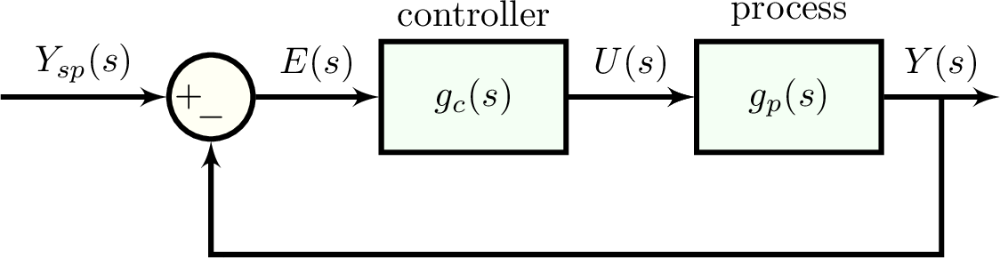

# Control systems

we build upon `simulate` to simulate feedback and feedforward control systems.

## PI, PID controller transfer functions

we express PID controller transfer functionas in the form:

$$g_c(s)=K_c \bigl[1+\frac{\tau_I}{s}+\tau_D s \frac{1}{\tau_D \alpha s + 1}\bigr]$$

where $\alpha$ characterizes the derivative filter. this controller function function governs the controller output in response to the input error signal.

To facilitate constructing PID controller transfer functions:

```julia
Kc = 2.0 # controller gain
τI = 1.0 # integral time constant
gc = PI(Kc, τI) # PI-controller transfer function

τD = 0.1 # derivative time constant
gc = PID(Kc, τI,  τD, α=0.0) # PID-controller transfer function with derivative filter α
```


and take an error signal as input and output the controller output (affecting the manipulated variable).

## servo response of a simple control system

with block diagram algebra, we can use [`simulate`](@ref) to simulate a control system. as an example, we simulate the response of a simple feedback control system to a set point change.



as an example, we specify $g_c(s)$ as a PI controller and $g_p(s)$ as a first-order system. the latter describes how the process responds to inputs. the input to the process here is provided by the controller.

```julia
gc = PI(1.0, 1.0) # controller transfer function
gp = 3 / (4 * s + 1) # process transfer function
```

via block diagram algebra, we can solve for the transfer function governing the response to set point changes.

```julia
g_ol = gc * gp # open-loop transfer function

g_servo = g_ol / (1 + g_ol) # transfer function for servo response
```

the response of the process to a unit step set point change is thus:
```julia
Y_sp = 1 / s # unit step set point change
Y = g_servo * Y_sp # resulting output in response to our set point change
```

finally, we can find the response by inverting `Y` into the time domain:
```julia
final_time = 12.0
t, y = simulate(Y, final_time)
```

to also see the controller output, we build the error signal `E` and use $g_c(s)=U(s)/E(s)$ to get `U`.

```julia
E = Y_sp - Y # error signal
U = gc * E # resulting controller output
t, u = simulate(U, final_time) # controller output in the time domain
```

a cheap way of getting the set point $y_{sp}(t)$ is:
```julia
t, ysp = simulate(Y_sp, final_time)
```

finally, we can plot `y`, `ysp`, and `u` against `t` to visualize the response of our feedback PI conrol system to a set point change.


```@docs
    PID
    PI
```
