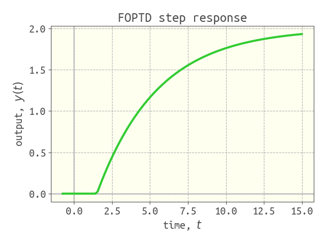
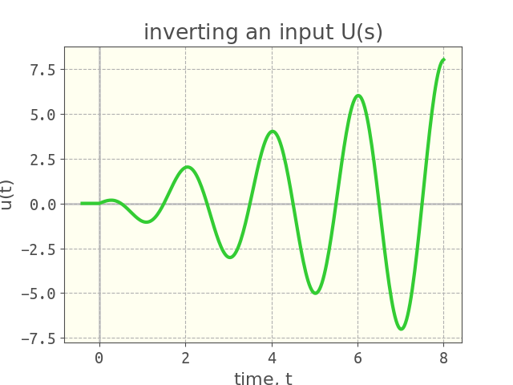

# Simulation

we wish simulate to simulate the response $y(t)$ (output) of a linear, time-invariant system, characterized by a transfer function $g(s)$, to an input $u(s)$. 


`simulate` takes the output $Y(s)$ and, essentially, inverts $Y(s)$ into the time domain to arrive at $y(t)$. in each case, `simulate` returns an array of times `t` and corresponding output values, `y`.

## response of an underdamped second-order system to a unit step input

```julia
g = 4 / (4 * s ^ 2 + 0.8 * s + 1) # second order transfer function, underdamped

U = 1 / s # unit step input
Y = g * U # system output

t, y = simulate(Y, 50.0) # simulate until t = 50
```

we can then plot the `y` array versus the `t` array:

```julia
viz_response(t, y, plot_title="SO underdamped step response")
```


## response of a first-order plus time delay system to a unit step input

```julia
K = 2.0 # gain
τ = 4.0 # time constant
θ = 1.5 # time delay
g = K * exp(-θ * s) / (τ * s + 1) # FOPTD transfer function

U = 1 / s # step input
Y = g * U

t, y = simulate(Y, 15.0) # simulate until t = 15

viz_response(t, y, plot_title="FOPTD step response")
```



## inverse Laplace transform

to emphasize that our `simulate` function takes a function of the complex frequency `s` and inverts it into the time domain, consider the Laplace transform of $t \cos(at)$:

$$\mathcal{L}[t \cos(at)] = \dfrac{s^2-a^2}{(s^2+a^2)^2}.$$

we can numerically invert $\dfrac{s^2-a^2}{(s^2+a^2)^2}$ as follows:

```julia
a = π
U = (s^2 - a^2) / (s^2 + a^2) ^ 2

t, u = simulate(U, 8.0, nb_time_points=300) # simulate until t=8, use 300 time points for high resolution

viz_response(t, u, plot_title=L"inverting an input $U(s)$", plot_ylabel=L"$u(t)$")
```

the `nb_time_points` argument gives a `t` array with higher resolution for plotting the response.



## under the hood

under the hood, `simulate` converts the system into a state space ODE in the time domain and uses `DifferentialEquations.jl` (see [here](https://github.com/JuliaDiffEq/DifferentialEquations.jl)) to solve the resulting ODE.

# detailed docs

```@docs
    simulate
```
