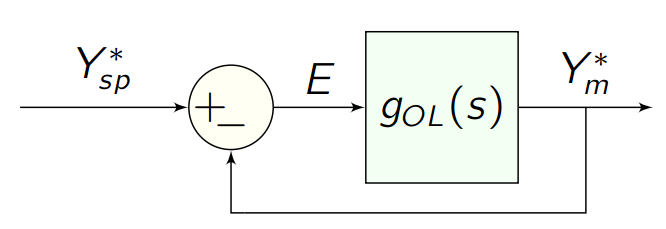

# transfer functions

the response [output $Y(s)$] of a linear, time-invariant system to any input [$U(s)$] is characterized by a transfer function $g(s)=Y(s)/U(s)$.

## constructing a transfer function

we use a data structure, `TransferFunction`, to represent a transfer function. for example, consider the transfer function
$$g(s)=\dfrac{5s+1}{s^2 + 4s+5}$$.

we can construct $g(s)$ in an intuitive way that resembles the algebraic expression:

```julia
g = (5 * s + 1) / (s ^ 2 + 4 * s + 5) # way 1
```

alternatively, we can construct a `TransferFunction` using the coefficients associated with the powers of $s$ in the polynomials composing the numerator and denominator, respectively, of $g(s)$. The coefficients of the highest powers of $s$ go first.
```julia
g = TransferFunction([5, 1], [1, 4, 5]) # way 2
```

note that, under the hood, we defined `s` such that `s == TransferFunction([1, 0], [1])`.

as rational functions associated with a time delay, each `TransferFunction` data structure has a `numerator` (a polynomial in `:s`), `denominator` (a polynomial in `:s`), and `time_delay` (a real number) attribute. access these attributes as follows:

```julia
g.numerator   # 5s + 1, a `Poly`
g.denominator # s² + 4s + 5, a `Poly`
g.time_delay  # 0.0, a `Float64`
```

`g.numerator` and `g.denominator` are `Poly` types from the package [Polynomials.jl](https://github.com/JuliaMath/Polynomials.jl).

## time delays

to construct a transfer function with a time delay, such as:
$$g(s)=\dfrac{3}{2s+1}e^{-2s}$$

```julia
θ = 2.0                              # time delay
g = 3 / (2 * s + 1) * exp(-θ * s)    # way 1
g = TransferFunction([3], [2, 1], θ) # way 2
```

## zeros, poles, k-factor representation

we can write any transfer function $g(s)$ in terms of its poles ($p_j$), zeros ($z_j$), k-factor ($k$), and time delay ($\theta$):

$$g(s)=k\dfrac{\Pi_j (s-z_j)}{\Pi_j(s-p_j)}e^{-\theta s}$$

the scalar factor $k$ allows us to uniquely specify a transfer function in terms of its poles, zeros, and time delay. note that the $k$-factor is not equal to the zero-frequency gain.

for example:

$$g(s)=\dfrac{5s+1}{s^2 + 4s+5}=5\dfrac{(s+1/5)}{(s+2+i)(s+2-i)}$$

#### construting a transfer function from its zeros, poles and k-factor

```julia
g = zeros_poles_k([-1/5], [-2 + im, -2 - im], 5.0, time_delay=0.0)  # way 3
```

the `im` is the imaginary number $i$. see the [Julia docs on complex numbers](https://docs.julialang.org/en/v1/manual/complex-and-rational-numbers/).

#### computing the poles, zeros, and k-factor of a transfer function

```
g = (5 * s + 1) / (s ^ 2 + 4 * s + 5)
zeros_poles_k(g) # [-0.2], [-2-im, -2+im], 5
```

## transfer function algebra

we can add `+`, subject `-`, multiply `*`, and divide `/` transfer functions.

```julia
g₁ = 3 / (s + 2)
g₂ = 1 / (s + 4)

g_product = g₁ * g₂ # 3 / (s^2 + 6s + 8)

g_sum = g₁ + g₂     # (4s + 14) / (s^2 + 6s + 8)
```

## evaluate a transfer function at a complex number

for example, to evaluate $g(s)=\dfrac{4}{s+2}$ at $s=1-i$:
```julia
g = 4 / (s + 2)
evaluate(g, 2 * im) # 1 - im
```

## zero-frequency gain of a transfer function

compute the zero-frequency gain of a transfer function $g(s)$, which is $g(s)$ evaluated at $s=0$, as follows:

```julia
g = (5 * s + 1) / (s ^ 2 + 4 * s + 5)
zero_frequency_gain(g) # 0.2
```

the zero-frequency gain is the ratio of the steady state output value to the steady state input value (e.g., consider a step input). note that the zero-frequency gain could be infinite or zero, which is why we do not have a function to construct a transfer function from its zeros, poles, and *zero-frequency gain*.

## poles, zeros, and zero-frequency gain of a transfer function

compute the poles, zeros, and zero-frequency gain of a transfer function all at once as follows:

```julia
g = (5 * s + 5) / (s ^ 2 + 4 * s + 5)
z, p, gain = zeros_poles_gain(g)
# z = [-1.0]
# p = [-2-im, -2+im]
# gain = 1.0
```

## cancel poles and zeros

cancel pairs of identical poles and zeros in a transfer function as follows:

```julia
pole_zero_cancellation(s * (s+1) / ((s+3) * s * (s+1) ^ 2)) # 1 / ((s+3) * (s+1))
```

note that this cancellation is done automatically when multiplying, dividing, adding, and subtracting transfer functions.

under the hood, we compare all pairs of poles and zeros to look for identical pairs via `isapprox`. after removing identical pole-zero pairs, we reconstruct the transfer function from the remaining poles, zeros, and k-factor. we ensure that the coefficients in the resulting rational function are real.

## the order of a transfer function

we can find the order of the polynomials in the numerator and denominator of the rational function comprising the transfer function:

```julia
g = (s + 1) / ((s + 2) * (s + 3))
system_order(g) # (1, 2)
```

note that is only the *apparent* order; you may need to call `pole_zero_cancellation` to get the effective order:
```julia
g = (s + 1) / ((s + 2) * (s + 3) * (s + 1))
system_order(g) # (1, 3)
g = pole_zero_cancellation(g)
system_order(g) # (0, 2)
```

## frequency response of an open-loop transfer function



compute the critical frequency, gain crossover frequency, gain margin, and phase margin of a closed loop control system with open-loop transfer function `g_ol` with `gain_phase_margins`. for example, consider:

$$g_{ol}(s)=\dfrac{2e^{-s}}{5s+1}$$

```julia
g_ol = 2 * exp(-s) / (5 * s + 1)

margins = gain_phase_margins(g_ol)

margins.ω_c # critical freq. (radians / time)
margins.ω_g # gain crossover freq. (radians / time)
margins.gain_margin # gain margin
margins.phase_margin # phase margin (radians)
```


## special transfer functions

### (0, 1) order transfer functions

$$g(s)=\frac{K}{\tau s +1}$$

easily construct:

```julia
K = 2.0
τ = 3.0
g = first_order_system(K, τ) # 2 / (3 * s + 1)
```

compute time constant:
```
time_constant(10 / (6 * s + 2)) # 3
```

### (0, 2) order transfer functions

$$g(s)=\frac{K}{\tau^2 s^2 + 2\tau \xi s +1}$$

easily construct:

```julia
K = 1.0
τ = 2.0
ξ = 0.1
g = second_order_system(K, τ, ξ) # 1 / (4 * s^2 + 0.4 * s + 1)
```

compute time constant, damping coefficient:
```julia
g = 1.0 / (8 * s^2 + 0.8 * s + 2)
τ = time_constant(g) # 2.0
ξ = damping_coefficient(g) # 0.1
```

## closed-loop transfer functions

to represent a closed-loop transfer function, we use a special transfer function type, `ClosedLoopTransferFunction`.
this is only necessary when time delays are involved, but it works for when time delays are *not* involved as well.


using block diagram algebra, we find the closed-loop transfer functions that relate changes in the output $y$ to changes in the set point $y_{sp}$ and to changes in the disturbance $d$:

$$g_r(s)=\dfrac{Y(s)}{D(s)}=\dfrac{g_d(s)}{1+g_c(s)g_u(s)g_m(s)}$$

$$g_s(s)=\dfrac{Y(s)}{Y_{sp}(s)}=\dfrac{g_c(s)g_u(s)g_m(s)}{1+g_c(s)g_u(s)g_m(s)}$$

we construct these two closed-loop transfer functions as `gr` and `gs` as follows.

```julia
# PI controller transfer function
pic = PIController(1.0, 2.0)
gc = TransferFunction(pic)

# process, sensor dynamics
gu = 2 / (4 * s + 1) * exp(-0.5 * s)
gm = 1 / (s + 1) * exp(-0.1 * s)
gd = 6 / (6 * s + 1)

# open-loop transfer function
g_ol = gc * gu * gm

# closed-loop transfer function for regulator response
gr = ClosedLoopTransferFunction(gd, g_ol)

# closed-loop transfer function for servo response
gs = ClosedLoopTransferFunction(g_ol, g_ol)
```

## detailed docs

```@docs
    TransferFunction
    ClosedLoopTransferFunction
    zero_frequency_gain
    zeros_poles_gain
    zeros_poles_k
    pole_zero_cancellation
    evaluate
    proper
    strictly_proper
    characteristic_polynomial
    zpk_form
    system_order
    first_order_system
    second_order_system
    time_constant
    damping_coefficient
    gain_phase_margins
```
