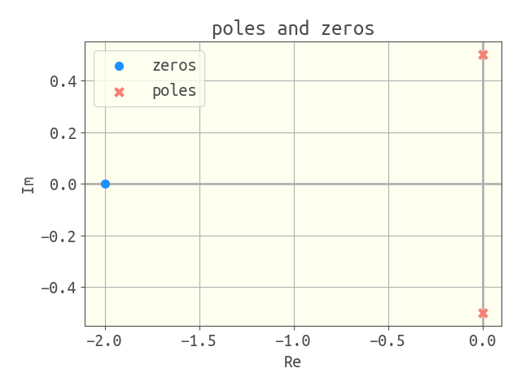
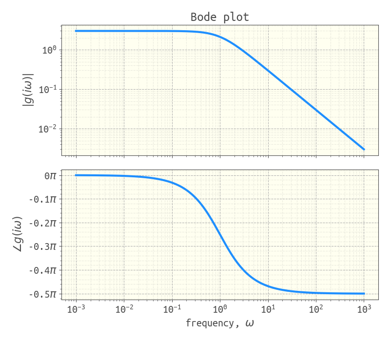

# Visualization

## poles and zeros of a transfer function

```
g = (s + 2) / (s^2 + 1/4)
viz_poles_and_zeros(g)
```



## response of a system to an input

```
g = 4 / (4 * s ^ 2 + 0.8 * s + 1)
u = 1 / s
t, y = simulate(g * u, (0.0, 50.0))
viz_response(t, y, plot_title="SO underdamped step response")
```


## Nyquist diagram

```
g = 1 / (s^2 + s + 1)
nyquist_diagram(g)
```


## Bode plot

```
g = 3 / (s + 1)
bode_plot(g, log10_ω_min=-4.0, log10_ω_max=4.0)
```



## Root locus plot

```
g_ol = 4 / (s + 3) / (s + 2) / (s + 1)
root_locus(g_ol)
```


## hipster plot theme

invoke the hipster plot theme used to make plots for this documentation by:

```
using Controlz
using PyPlot
PyPlot.matplotlib.style.use(normpath(joinpath(pathof(Controlz), "..", "hipster.mplstyle")))
```

## detailed docs

```@docs
    viz_poles_and_zeros
    viz_response
    nyquist_diagram
    bode_plot
    root_locus
```
